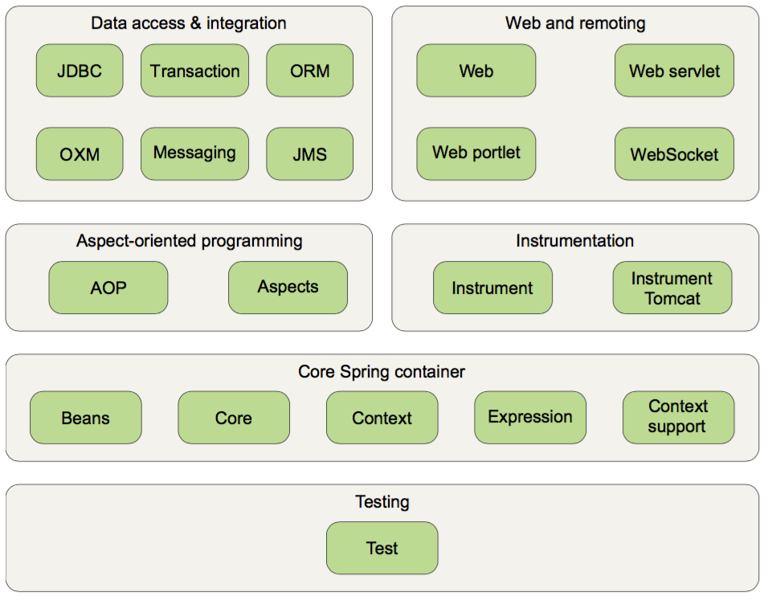
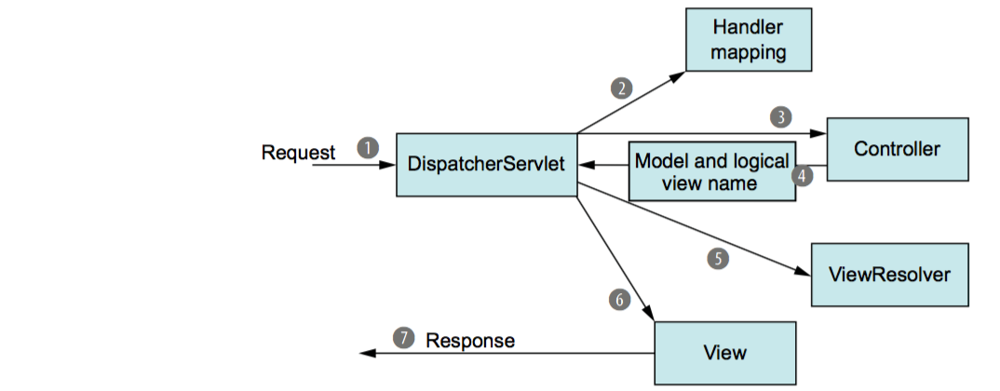

# spring
Spring Framework

> The Spring Framework is an application framework and inversion of control container for the Java platform. The framework's core features can be used by any Java application, but there are extensions for building web applications on top of the Java EE platform. Although the framework does not impose any specific programming model, it has become popular in the Java community as an alternative to, replacement for, or even addition to the Enterprise JavaBeans (EJB) model. The Spring Framework is open source. [WikiPedia](https://en.wikipedia.org/wiki/Spring_Framework)

#Core Spring

- primary features are 
	- dependency injection ( DI )
	- Aspect Oriented Programming ( AOP )

###[RESTful Web Service](RESTfulWebService/)
- Spring 4.3.3 <--latest: Sep, 2016-->
- jackson 2.8.4 <--latest: Oct, 2016-->
- hibernate 5.2.3 <--latest: Sep, 2016-->

##1 Springing into action

###1.1 Simplifying Java development

> Spring’s usefulness isn’t limited to server-side development. Any Java application can benefit from Spring in terms of simplicity, testability, and loose coupling.

Spring employs four key strategies:

- Lightweight and minimally invasive development with POJOs
- Loose coupling through DI and interface orientation
- Declarative programming through aspects and common conventions
- Eliminating boilerplate code with aspects and templates

###1.2 Containing beans
In a Spring-based application, your application objects live in the Spring container. 

- the container creates the objects, wires them together, configures them, and manages their complete lifecycle from cradle to grave (or new to finalize(), as the case may be).


###1.3 surveying the spring landscape
Spring Framework is focused on simplifying enterprise Java development through DI, AOP, and boilerplate reduction.

#### The Spring Framework is made up of six well-defined module categories:


- CORE SPRING CONTAINER
	- The centerpiece of the Spring Framework is a container that manages how the beans in a Spring-enabled application are created, configured, and managed. 
	- In this module is the Spring bean factory, which is the portion of Spring that provides DI. Building on the bean factory, you’ll find several implementations of Spring’s application context, each of which provides a different way to configure Spring.

- SPRING’S AOP MODULE
	- aspect-oriented programming

- DATA ACCESS AND INTEGRATION
	- Working with JDBC often results in a lot of boilerplate code that gets a connection, creates a statement, processes a result set, and then closes the connection. Spring’s JDBC and data-access objects (DAO) module abstracts away the boilerplate code so that you can keep your database code clean and simple, and prevents problems that result from a failure to close database resources. 
	- For those who prefer using an object-relational mapping (ORM) tool over straight JDBC, Spring provides the ORM module. Spring’s ORM support builds on the DAO support, providing a convenient way to build DAOs for several ORM solutions. Spring doesn’t attempt to implement its own ORM solution but does provide hooks into several popular ORM frameworks, including Hibernate, Java Persistence API, Java Data Objects

- WEB AND REMOTING

- INSTRUMENTATION

- TESTING

## 2 Wiring beans

- objects aren’t responsible for finding or creating the other objects that they need to do their jobs.
- the container gives them references to the objects that they collaborate with
- The act of creating these associations between application objects is the essence of dependency injection (DI) and is commonly referred to as wiring.

### 2.1
three primary wiring mechanisms:

-  Explicit configuration in XML
-  Explicit configuration in Java
-  Implicit bean discovery and automatic wiring


- lean on automatic configuration
-  favor the type-safe and more powerful JavaConfig over XML
-  fall back on XML only in situations where there’s a convenient XML namespace you want to use that has no equivalent in JavaConfig.


At the core of the Spring Framework is the Spring container. This container manages the lifecycle of the components of an application, creating those components and ensuring that their dependencies are met so that they can do their job.

## 3 Advanced wiring

### 3.4 Scoping beans

By default, all beans created in the Spring application context are created as single- tons.

Spring defines several scopes under which a bean can be created, including the following:

-  Singleton	—One instance of the bean is created for the entire application.
-  Prototype	—One instance of the bean is created every time the bean is injected into or retrieved from the Spring application context.
-  Session 	—In a web application, one instance of the bean is created for each session.
-  Request	—In a web application, one instance of the bean is created for each request.


```java
@Component
@Scope(ConfigurableBeanFactory.SCOPE_PROTOTYPE)
public class Notepad { ... }
```

specify prototype scope by using the SCOPE_PROTOTYPE constant from the ConfigurableBeanFactory class. You could also use @Scope("prototype"), but using the SCOPE_PROTOTYPE constant is safer and less prone to mistakes.


## 4 Aspect Oriented Spring

> With AOP, you still define the common functionality in one place, but you can declaratively define how and where this functionality is applied without having to modify the class to which you’re applying the new feature.

Aspects are often described in terms of advice, pointcuts, and join points.

####ADVICE
> aspects have a purpose—a job they’re meant to do. In AOP terms, the job of an aspect is called advice.

Advice defines both the what and the when of an aspect.

Spring aspects can work with five kinds of advice:

-  Before—The advice functionality takes place before the advised method is invoked.
-  After—The advice functionality takes place after the advised method completes, regardless of the outcome.
-  After-returning—The advice functionality takes place after the advised method successfully completes.
-  After-throwing—The advice functionality takes place after the advised method throws an exception.
-  Around—The advice wraps the advised method, providing some functionality before and after the advised method is invoked.

####JOIN POINTs

> A join point is a point in the execution of the application where an aspect can be plugged in. This point could be a method being called, an exception being thrown, or even a field being modified. These are the points where your aspect’s code can be inserted into the normal flow of your application to add new behavior.

####POINTCUTs

> If advice defines the what and when of aspects, then pointcuts define the where.


####ASPECTs

> An aspect is the merger of advice and pointcuts. Taken together, advice and point- cuts define everything there is to know about an aspect—what it does and where and when it does it.

####INTRODUCTIONs
> An introduction allows you to add new methods or attributes to existing classes.

####WEAVING
> Weaving is the process of applying aspects to a target object to create a new proxied object.

summary:

- advice contains the cross-cutting behavior that needs to be applied to an application’s objects. 
- The join points are all the points within the execution flow of the application that are candidates to have advice applied. 
- The pointcut defines where (at what join points) that advice is applied.
- pointcuts define which join points get advised.


# Spring on the web

## 5 build spring web applications

-  Mapping requests to Spring controllers
-  Transparently binding form parameters
-  Validating form submissions

Spring MVC helps you build web- based applications that are as flexible and as loosely coupled as the Spring Framework itself.

### 5.1 Getting started with Spring MVC

Like most Java- based web frameworks, Spring MVC funnels requests through a single front controller servlet.

- A front controller is a common web application pattern where a single servlet delegates responsibility for a request to other components of an application to perform actual processing. 
	- In the case of Spring MVC, DispatcherServlet is the front controller.
- The DispatcherServlet’s job is to send the request on to a Spring MVC controller.
	- A controller is a Spring component that processes the request.
	- the controller doesn’t get coupled to a particular view, the view name passed back to DispatcherServlet doesn’t directly identify a specific JSP. It doesn’t even necessarily suggest that the view is a JSP. Instead, it only carries a logical name that will be used to look up the actual view that will produce the result.



1. request leaves the browser
2. handler mappings: to figure out where the request’s next stop will be; pays particular attention to the URL carried by the request
3. Once an appropriate controller has been chosen, At the controller, the request drops off its payload, waits while the controller processes that information.
4. It then sends the request, along with the model and view name, back to the DispatcherServlet
5. only carries a logical name that will be used to look up the actual view that will produce the result. 
	- DispatcherServlet consults a view resolver.
	- to map the logical view name to a specific view implementation
6. view implementation, typically a JSP, where it delivers the model data.
7. The view will use the model data to render output that will be carried back to the client by the (not- so-hardworking) response object.

```java 
public class WebAppInitializer extends AbstractAnnotationConfigDispatcherServletInitializer {
    @Override
    protected Class<?>[] getRootConfigClasses() {
        return new Class<?>[]{RootConfig.class};
    }

    @Override
    protected Class<?>[] getServletConfigClasses() { // Specify configuration class
        return new Class<?>[]{WebConfig.class};
    }

    @Override
    protected String[] getServletMappings() {
        return new String[]{"/"}; // Map DispatcherServlet to
    }
}
```

- getServletMappings(), identifies one or more paths that DispatcherServlet will be mapped to. In this case, it’s mapped to /, indicating that it will be the application’s default servlet. It will handle all requests coming into the application.

## 6 Rendering web views
### 6.1 understanding view resolution

- controller only knows about the view by a logical view name.
- InternalResourceViewResolver
	- configured to apply a prefix of `/WEB-INF/views/`
	-  typically used for JSP
		- most Java web applications use JSP

```
	/WEB-INF/views/home.jsp
	|-------------|----|---|
		prefix  v   suffix
		   logical view name
```

a prefix and a suffix are attached to the view name to determine the physical path to a view resource in the same web application.

> some view resolvers, such as ResourceBundleViewResolver, directly map a logical view name to a specific implementation of the View interface, Internal- ResourceViewResolver takes a more indirect approach.

```java
@Bean
public ViewResolver viewResolver() {
  InternalResourceViewResolver resolver =
      new InternalResourceViewResolver();
  resolver.setPrefix("/WEB-INF/views/");
  resolver.setSuffix(".jsp");
  return resolver;
}
```

### 6.3 Defining a layout with Apache tiles views

- use a layout engine such as Apache Tiles to define a com- mon page layout that will be applied to all pages. 

configuring
	
- TilesConfigurer bean whose job is to locate and load tile definitions and generally coordinate Tiles.
- need a TilesViewResolver bean to resolve logical view names to tile definitions.

### 6.4 Thymeleaf
A web template engine

- Thymeleaf, an alternative to JSP, as the view layer of a Spring MVC application. Thymeleaf is a compelling option because it enables the cre- ation of natural templates that are still pure HTML and can be edited and viewed in the raw as if they were static HTML, but still render dynamic model data at runtime. More- over, Thymeleaf templates are largely decoupled from servlets, enabling them to be used in places where JSPs can’t.

## 7 Advanced Spring MVC

| Spring exception | HTTP status code |
| --- | --- |
| BindException	| 400 - Bad Request |
| ConversionNotSupportedException | 500 - Internal Server Error |
| HttpMediaTypeNotAcceptableException | 406 - Not Acceptable | 	
| HttpMediaTypeNotSupportedException | 415 - Unsupported Media Type |
| HttpMessageNotReadableException | 400 - Bad Request | 	
| HttpMessageNotWritableException | 500 - Internal Server Error |
| HttpRequestMethodNotSupportedException | 405 - Method Not Allowed | 
| MethodArgumentNotValidException | 400 - Bad Request | 	
| MissingServletRequestParameterException | 400 - Bad Request | 
| MissingServletRequestPartException | 400 - Bad Request | 	
| NoSuchRequestHandlingMethodException | 404 - Not Found | 	
| TypeMismatchException | 400 - Bad Request |	

## 8 Working with Spring Web Flow

Spring Web Flow is a web framework that enables the development of elements fol- lowing a prescribed flow. 
 
- It’s possible to write a flowed application with any web framework
- Spring Web Flow is an extension to Spring MVC that enables development of flow- based web applications.
- It does this by separating the definition of an application’s flow from the classes and views that implement the flow’s behavior.
- [Spring Web Flow: wikipedia](https://en.wikipedia.org/wiki/Spring_Web_Flow)
	- providing the infrastructure for building and running rich web applications.
	- SWF  tries to solve 3 core problems facing web application developers:
		- 'How do you express page navigation rules?'
		- 'How do you manage navigation and conversational state?'
		- 'How do you facilitate modularization and reuse?'
- Spring Web Flow is built on a foundation of Spring MVC. 
	- That means all requests to a flow first go through Spring MVC’s DispatcherServlet.

```
Flow registry basse path     Flow ID     Flow definition
/WEB-INF/flows/              order/      order-flow.xml
```
## 9 Securing web applications

Spring Security, a security framework implemented with Spring AOP and servlet filters.

two main areas that Spring Security targets:

- “authentication” and 
- “authorization” (or “access-control”).

> “Authentication” is the process of establishing a principal is who they claim to be (a “principal” generally means a user, device or some other system which can perform an action in your application).

> “Authorization” refers to the process of deciding whether a principal is allowed to perform an action within your application.

### 9.1 

### 10 

>  I believe that interfaces are key to writing loosely coupled code and that they should be used at all layers of an application, not just at the data-access layer.


#Sources: 

- [Spring in Action, 4th Edition](https://www.manning.com/books/spring-in-action-fourth-edition) - book homepage
- [WikiPedia](https://en.wikipedia.org/wiki/Spring_Framework) - Spring Framework
- [docs.spring.io](http://docs.spring.io/spring/docs/current/spring-framework-reference/html/aop.html)	- AOP

