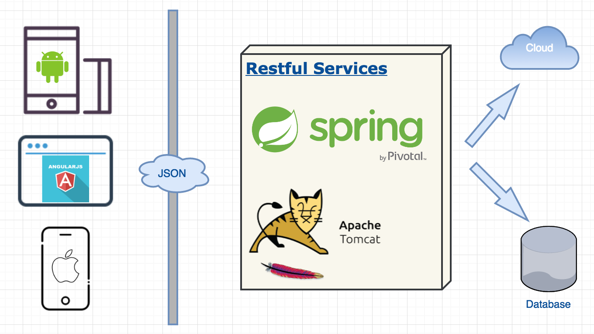

#RESTful Web Service + Spring Security

##[RESTful Web Service](https://github.com/junjunguo/spring/tree/master/RESTfulWebService) ⇌ [Angular frontend](https://github.com/junjunguo/JavaScript/tree/master/Angular2/angular-login-spring)
- RESTful Web Service:
    - spring 4.3.3
    - Hibernate 5.2.3
- Angular frontend
    - Angular 2
    - Bootstrap 3




##MySQL


### MySQL operations: `mysql>`

show all databases:

```mysql
SHOW DATABASES;
```

show users:

```shell
SELECT User FROM mysql.user; 
```

show current mysql version and other info:

```shell
\s
```

access a database 
- USE, like QUIT, does not require a semicolon

```shell
USE database_name
mysql> use restfulwebservice;
Database changed
```

Show tables:

```shell
mysql> SHOW TABLES;
Empty set (0.00 sec)
```


### Prepare DB system

MySql installed with `brew`

show install info:

```shell
brew info mysql
```

install mysql:

```shell
brew install mysql
```

**Start MySQL**

```shell
mysql.server start
```

to connect and run:

```shell
mysql -uroot
```

show mysql version

```shell
mysql --version
```
